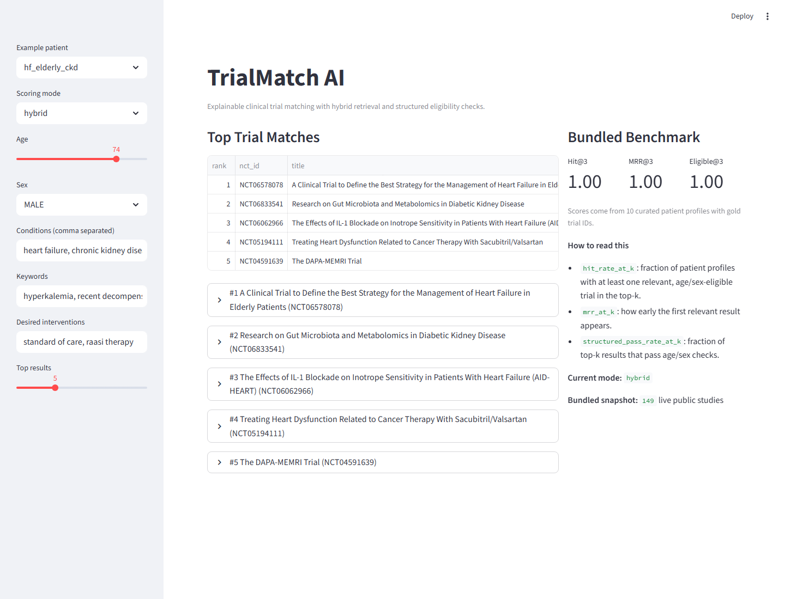
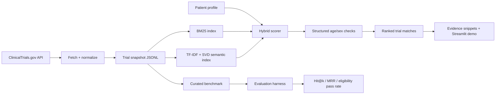

# TrialMatch AI

TrialMatch AI is an explainable clinical trial retrieval system built on top of live public data from ClinicalTrials.gov. It ranks studies for a patient profile, exposes the evidence behind each match, applies structured eligibility checks, and includes a curated benchmark so retrieval quality is measurable.

## Why This Matters

Clinical trial search is often keyword-heavy, difficult to audit, and hard to adapt to an individual patient context. This repo focuses on a more defensible workflow: combine lexical and semantic retrieval, keep the matching logic transparent, and surface explicit evidence and limitations instead of opaque recommendations.

## Demo



## Snapshot

- `149` live public studies fetched from ClinicalTrials.gov
- `10` curated patient profiles with gold trial IDs
- `3` scoring modes: `bm25`, `semantic`, `hybrid`
- `100%` top-1 hit rate for the bundled hybrid system on the bundled benchmark

## Core Features

- Fetches open studies directly from the ClinicalTrials.gov v2 API
- Normalizes titles, summaries, conditions, interventions, and structured eligibility metadata
- Builds a hybrid retriever with lexical BM25 plus TF-IDF and TruncatedSVD semantic search
- Scores patient-to-trial matches with condition overlap, intervention overlap, and age/sex checks
- Surfaces evidence snippets from trial eligibility text
- Benchmarks ranking quality with exact gold NCT IDs
- Runs locally with no external model API required

## Architecture



## Technical Stack

- Python 3.13
- Streamlit
- scikit-learn
- rank-bm25
- pandas
- pytest

## Benchmark

Metrics below come from the bundled `data/benchmarks/patient_profiles.json` set.

### Top-1

| mode | hit@1 | mrr@1 | eligibility pass |
| --- | ---: | ---: | ---: |
| bm25 | 1.00 | 1.00 | 1.00 |
| semantic | 0.90 | 0.90 | 1.00 |
| hybrid | 1.00 | 1.00 | 1.00 |

### Top-3

| mode | hit@3 | mrr@3 | eligibility pass |
| --- | ---: | ---: | ---: |
| bm25 | 1.00 | 1.00 | 1.00 |
| semantic | 1.00 | 0.95 | 0.97 |
| hybrid | 1.00 | 1.00 | 1.00 |

The benchmark is intentionally small and transparent: ten curated profiles paired with exact gold NCT IDs. It is designed to make behavior inspectable, not to overclaim clinical validity.

## Local Setup

```powershell
py -3.13 -m venv .venv
.\.venv\Scripts\Activate.ps1
python -m pip install --upgrade pip
pip install -r requirements.txt
```

Or use the bundled bootstrap script:

```powershell
powershell -ExecutionPolicy Bypass -File scripts/bootstrap.ps1
```

## Run The App

```powershell
streamlit run app.py
```

Or:

```powershell
powershell -ExecutionPolicy Bypass -File scripts/run_demo.ps1
```

## Refresh The Trial Snapshot

```powershell
trialmatch-fetch --limit-per-condition 30
```

Default condition coverage:

- heart failure
- type 2 diabetes
- parkinson disease
- chronic obstructive pulmonary disease
- breast cancer

## Run Evaluation

```powershell
trialmatch-eval --top-k 3
```

## Run Tests

```powershell
pytest
```

## Project Structure

```text
trialmatch_ai/
  app.py
  assets/
  data/
    benchmarks/
    raw/
  docs/
  scripts/
  src/trialmatch/
  tests/
```

## Limitations

- The project only enforces structured age/sex rules. Free-text inclusion and exclusion criteria still require manual review.
- The benchmark is portfolio-sized, not a clinical validation study.
- Trial metadata can change over time as the public registry is updated.

## Roadmap

- Add richer free-text eligibility parsing beyond structured age/sex checks
- Expand the benchmark to include harder counterfactual profiles
- Add calibration and score-distribution diagnostics for ranking confidence
